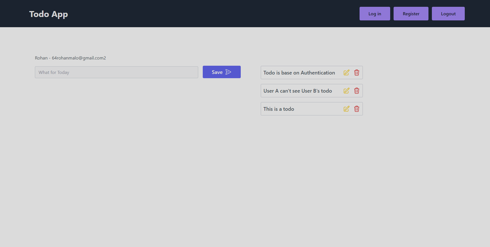

# This is a Todo app with Authentication system

## Installation

Clone the repo

```bash
  git clone https://github.com/reo127/todosWithAuth.git
  cd todosWithAuth
```

For Frontend
```bash
cd client
npm i
npm start
```

For Backend - Don't forget to set the .env files
```bash
cd server
npm i
npm start
```

## Features

- Register, Login and Logout
- Todos are separated based on users


## Screenshots




## 🔗 Links

[](https://www.linkedin.com/in/rohan-malo-1bb400184/)
[](https://www.instagram.com/code.rohan127/)

